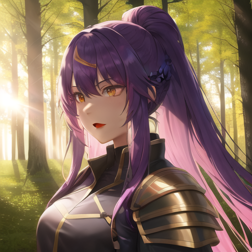
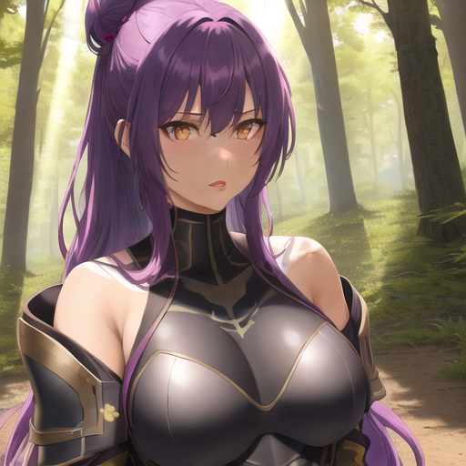
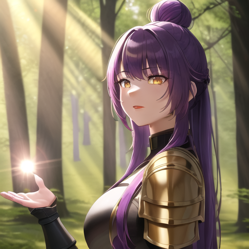
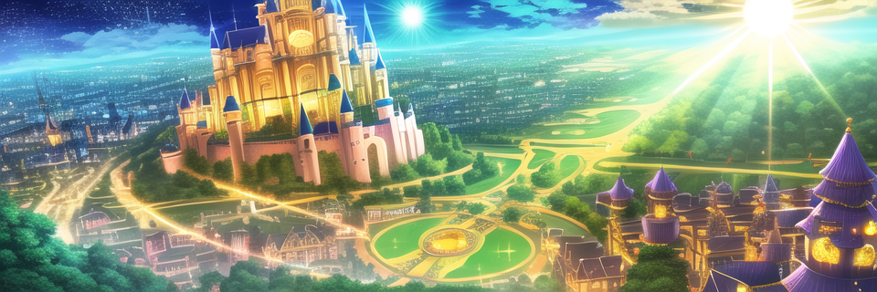

# Dockerized Anime Generation Toolkit

This is a dockerized implementation of [Stable Diffusion](https://en.wikipedia.org/wiki/Stable_Diffusion) packaged with an anime based diffusion model. Stable Diffusion is a deep learning, latent text-to-image (txt2img) diffusion model capable of generating photo-realistic images given any text input. The diffusion model that was packaged in this docker container can be found here: [Diffuser Model](https://huggingface.co/Azher/Anything-v4.5-vae-fp16-diffuser). This implementation is intended for horizontal scaling on cloud provider services like AWS, GCP, and Azure.

## Example Image Output

These are some of the example images with their corresponding commands. These commands are used to generate them using artificial intelligence. Feel free to test this out yourself!

```sh
./build.sh run --prompt "highres, 1girl, purple hair, long hair, yellow eyes, black warrior armor, warrior princess, battlefield, shadows, lens flare, masterpiece, sunshine, clothed, red lips, forest, breathtakingly beautiful, hair bun, tanned skin" --negative-prompt "lowres, bad anatomy, bad hands, text, error, missing fingers, extra digit, fewer digits, cropped, worst quality, low quality, normal quality, jpeg artifacts, signature, watermark, username, blurry, artist name, NSFW, cat ears, weapon, sword, shield"
```

### Purple-Haired Warrior Princess

<p align="center">
  
  
  
</p>

These three images are my rendition on a warrior with purple hair, yellow eyes on a battlefield. You can render these same exact images by copying the seed found in the image's names (more information on using seeds below).

### Beautiful Fantasy Village

```sh
./build.sh run --W 960 --H 320 --prompt "beautiful, fantasy, lens flair, masterpiece, sunny, bright, vibrant, cloudy, worried, neon, sparkling, radiant, sunshine, starry, dreams, background, village, grass, town, temple, emissive, utopia, castle" --negative-prompt "lowres, bad anatomy, bad hands, text, error, missing fingers, extra digit, fewer digits, cropped, worst quality, low quality, normal quality, jpeg artifacts, signature, watermark, username, blurry, artist name, boy, girl, people, face" --ddim_steps 25
```

<p align="center">
  
</p>

This image is a rendition of a beautiful village with a bright sky. You can render this same exact image by copying the seed found in the image's name (more information on using seeds below).

## Requirements

By default, this pipeline will render images using CPU by default. This is intended as rendering images on a GPU is extremely cost prohibitive. As a result of this, it will take a few minutes to create one image (Roughly 5 minutes and 20 seconds on a Ryzen 5 5600x CPU using the ```test``` option down below, your mileage may vary). The bundled dockerfile runs on 3.10-slim-bullseye, and as such is tested on **Debian 11** based systems. The operating System I used to personally test this docker container was "Ubuntu Jammy 22.04 (LTS)". If you're using **Alpine**, or **Windows**, or **macOS** it may not work, and as such, your mileage may vary (Will check compatability at a later date).

## Startup Guide (Need Debian-Based Linux Distributions)

### Docker setup (Ignore if you already have docker installed on your OS)

It is important to have docker engine installed prior to running this project. If you don't have it installed, follow the official [docker setup](https://docs.docker.com/engine/install/ubuntu/) guide.

### Git and Latest-version setup

The pipeline is managed using a single [`build.sh`](build.sh) script. Big kudos to [fboulnois](https://github.com/fboulnois) for setting this up. I cannot thank you enough. 

Start with the following command to pull from repo:

```sh
git clone https://github.com/azher-alnabi/anime-stable-diffusion-docker-container.git && cd anime-stable-diffusion-docker-container
```


## Build

First begin by building with the following command:

```sh
./build.sh build
```

## Testing

Run a test using the following command to see if an image has generated. Navigate to the `output` folder to view this image:

```sh
./build.sh test
```

This test should render a single 512x512 (height and width) image similar to the three images shown above.

## Run

### Text-to-Image 

Now run whatever prompts you want with the following command. Try out the options down below (Remember, by default it uses CPU to render images):

```sh
./build.sh run --prompt 'warrior princess'
```

### Options

Some of the options from [`txt2img.py`](https://github.com/CompVis/stable-diffusion/blob/main/scripts/txt2img.py) are implemented for compatibility:

* `--prompt [PROMPT]`: the prompt to render into an image
* `--negative-prompt [NEGATIVE_PROMPT]`: the prompt to not render into an image (default `None`)
* `--n_samples [N_SAMPLES]`: number of images to create per run (default 1)
* `--n_iter [N_ITER]`: number of times to run pipeline (default 1)
* `--H [H]`: image height in pixels (default 512, must be divisible by 64)
* `--W [W]`: image width in pixels (default 512, must be divisible by 64)
* `--scale [SCALE]`: Classifier Guidance Scale (CGS) (default 11)
* `--seed [SEED]`: RNG seed for repeatability (default is a random seed)
* `--ddim_steps [DDIM_STEPS]`: number of sampling steps (default 22)
* `--skip`: skip safety checker (default is the safety checker is on)
* `--model [MODEL]`: the model used to render images (default is `ckpt/anything-v4.5-vae-swapped`)
* `--scheduler [SCHEDULER]`: override the scheduler used to denoise the image (default `DPMSolverSinglestepScheduler`)

## Outputs

### Images

The images are saved as PNGs in the `output` folder using the prompt text. The `build.sh` script creates and mounts this folder as a volume in the docker container.

## Examples

These commands are both identical:

```sh
./build.sh run 'warrior princess'
./build.sh run --prompt 'warrior princess'
```

This command enables GPU rendering (Must use a Nvidia GPU) using the following command:

```sh
./build.sh run --device cuda --prompt 'warrior princess'
```

This command sets the seed to 255 (Allows rendering of image with constant output):

```sh
./build.sh run --seed 255 --prompt 'warrior princess'
```

Several commands can be combined together:

```sh
./build.sh run --skip --scale 11.0 --seed 255 --prompt 'warrior princess'
```

## Minimize Time Rendering

There are a few steps you can include if you want to minimize the time it takes to render an image.

* Make images smaller than 512x512 using `--W` and `--H` to decrease memory use and increase image creation speed
* Decrease the number of samples and increase the number of iterations with `--n_samples` and `--n_iter` to decrease overall memory use
* Skip the safety checker with `--skip` to run less code (Work in progress: Implementation by default)

### CPU Time Minimization

```sh
./build.sh run --skip \
  --W 256 --H 256 \
  --n_samples 1 --n_iter 1 --prompt 'warrior princess'
```

### GPU Time Minimization (Experimental, please open up an issue and let me know if any features are not working)

```sh
./build.sh run --device cuda --skip \
  --W 256 --H 256 --half --attention-slicing \
  --n_samples 1 --n_iter 1 --prompt 'warrior princess'
```

* `--attention-slicing`: use less memory at the expense of inference speed (default is no attention slicing)
* `--device [DEVICE]`: the cpu or cuda device to use to render images (default is `cpu`, switch to `cuda` for GPU rendering)
* `--half`: use float16 tensors instead of float32 (default `float32`)

## Running on Windows (Experimental, please open up an issue and let me know if any features are not working)

On Windows, if you aren't using WSL2 and instead use MSYS, MinGW, or Git Bash,
prefix your commands with `MSYS_NO_PATHCONV=1` (or export it beforehand):

```sh
MSYS_NO_PATHCONV=1 ./build.sh run --prompt 'warrior princess'
```

## Token setup (Experimental, please open up an issue and let me know if any features are not working)

As far as I am aware, you don't need to pass through a huggingface token currently, however open a github issue if an error occurs. The solution to a token problem may involve saving the [user access token](#huggingface-token) in a file called `token.txt`. Another way to solve this problem would be by adding the token manually using the following command:

* `--token [TOKEN]`: specify a Huggingface user access token at the command line instead of reading it from a file (default is a file)

## Docker Cleanup and Pruning

If you want to remove all docker images and containers, you can use the following command:

```sh
./build.sh clean
```

If you want to remove all docker images, containers, volumes, and output images, you can use the following command:

```sh
./build.sh wipe
```

## Disclaimer

By default, the default model that is being used in this docker image will render images that are **SFW** **(_Safe For Work_)**. As a result of this, the outputted images may be returned blank if an image is flagged for being **NSFW** **(_Not Safe For Work_)**. The built-in saftey checker is responsible for this, and may cause problems due to it being. If you want to skip over this saftey feature, and render images that have the potential for being **NSFW**, you can use the ```--skip``` feature set to disable the saftey checker. **Use at your own discretion**.

## Credits

Special Thanks to the following people and communities involved with helping me create this Docker container.

### Github Member: fboutnois
Thank you to fboutnois for the [original](https://github.com/fboulnois/stable-diffusion-docker) implementation of this Docker container, and for being super accommodating to my questions and requests. Check out their [github](https://github.com/fboulnois) profile for more of their work.

### HuggingFace Member: Furqanil Taqwa (Aka Linaqruf)
Thank you to Linaqruf for the creation of the base diffuser model: Linaqruf/anything-v3-better-vae. Their work can be found at: [Linaqruf Hugging Face Profile](https://huggingface.co/Linaqruf)

### HuggingFace and Github Member: Camenduru
Thank you to Camenduru for archiving the diffusers that was used in this docker container. Check out their [github](https://github.com/camenduru) and their [Hugging Face](https://huggingface.co/ckpt) profiles.

### Huggingface Community
Thank you to the Huggingface team for creating the AI community and Machine Learning platform, community found at: [Hugging Face Community Landing Page](https://huggingface.co/).

### Stability AI
Thank you to Stability AI for open sourcing Stable Diffusion. Learn more about their work at: [Stability AI Landing Page](https://stability.ai/).