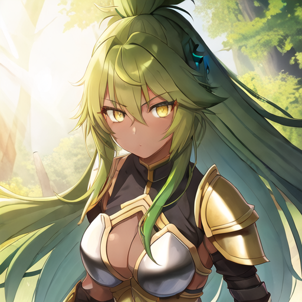
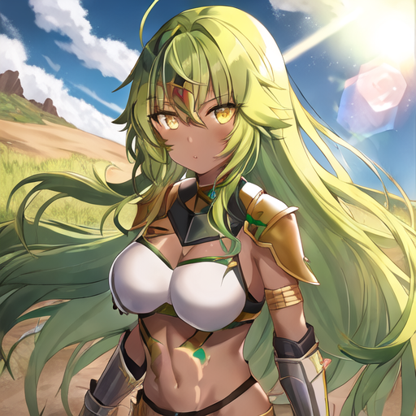
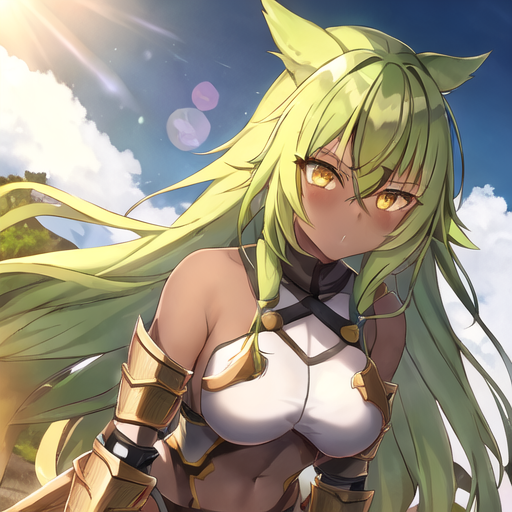

# Anime Generator Stable Diffusion Docker Container

This Docker container is a text-to-image (txt2img) generation tool that leverages Stable Diffusion with a packaged diffusion model. Stable Diffusion is a deep learning, latent txt2img diffusion model capable of generating photo-realistic images given any text input, for more information visit this wikipedia page: [Stable Diffusion](https://en.wikipedia.org/wiki/Stable_Diffusion). The diffusion model that was packaged in this docker container can be found here: [Diffuser Model](https://huggingface.co/ckpt/anything-v3-vae-swapped). This Docker container is built with horizontal scaling in mind, and as such will be able to placed on cloud provider services like AWS, GCP, and Azure.

## Example Image Output

These are some of the example images with their corresponding commands. These commands are used to generate them using artificial intelligence. Feel free to test this out yourself! Careful, this model may generate **NSFW** **(_Not Safe For Work_)**, images. **Use at your own discretion** (There is an command below that will mitigate this chance of rendering a **NSFW** image).

```sh
./build.sh run --skip --prompt "1girl, green hair, long hair, yellow eyes, warrior armor, warrior princess, tanned-black skin, battle field, shadows, lens flare, masterpiece" --negative-prompt "lowres, bad anatomy, bad hands, text, error, missing fingers, extra digit, fewer digits, cropped, worst quality, low quality, normal quality, jpeg artifacts, signature, watermark, username, blurry, artist name"
```

### Green-Haired Warrior Princess

<p align="center">
  
  
  
</p>

These three images are my rendition on a warrior with green hair, yellow eyes on a battlefield. You can render these same exact images by copying the seed found in the image's names (more information on using seeds below).

### Beautiful Fantasy Village

```sh
./build.sh run --skip --W 960 --H 320 --prompt "beautiful, fantasy, lens flair, masterpiece, sunny, bright, vibrant, cloudy, worried, neon, sparkling, radiant, sunshine, starry, dreams, background, village, grass, town, temple, emissive, utopia, castle" --negative-prompt "lowres, bad anatomy, bad hands, text, error, missing fingers, extra digit, fewer digits, cropped, worst quality, low quality, normal quality, jpeg artifacts, signature, watermark, username, blurry, artist name, boy, girl, people, face" --ddim_steps 25
```

<p align="center">
  
</p>

This image is a rendition of a beautiful village with a bright sky. You can render this same exact image by copying the seed found in the image's name (more information on using seeds below).

## Disclaimer

By default, this pipeline will render images that may be **NSFW** **(_Not Safe For Work_)**. The reason with why this will occur is that it utilizes the ```--skip``` feature set as this allows for the time with which it takes to render an image to be quicker. As such, if you use this tool for safe for work applications (SFW), do not include ```--skip```. **Use at your own discretion**.

## Requirements

By default, this pipeline will render images using CPU by default. This is intended as rendering images on a GPU is extremely cost prohibitive. As a result of this, it will take a few minutes to create one image (Roughly 4 minutes and 50 seconds on a Ryzen 5 5600x CPU using the ```test``` option down below, your mileage may vary). The bundled dockerfile runs on 3.10-slim-bullseye, and as such is tested on **Debian 11** based systems. The operating System I used to personally test this docker container was "Ubuntu 22.04 LTS". If you're using **Alpine**, or **Windows**, or **macOS** it may not work, and as such, your mileage may vary (Will check compatability at a later date).

## Quickstart

The pipeline is managed using a single [`build.sh`](build.sh) script. Big kudos to [fboulnois](https://github.com/fboulnois) for setting this up. I cannot thank you enough.

### Work in progress:

Pull Functionality using `./build.sh pull`. This functionality will allow you to pull the latest image once it is available. Currently, follow the build section to initialize Dockerfile. I need to setup github actions.

## Build

First begin by building with the following command:

```sh
./build.sh build
```

### Work in progress 

Work in progress: Make sure your [user access token](#huggingface-token) is saved in a file called `token.txt`. As far as I am aware, you don't need to pass through a huggingface token current;y, however open a github issue if an error occurs.

## Testing

Run a test using the following command to see if an image has generated in your `output` folder:

```sh
./build.sh test
```

This will render a single 512x512 (height and width) image similar to the three images shown above: [Warrior Princess 1](https://github.com/azher-alnabi/Anything-V3-SD-Docker-Container/blob/main/img/1girl,_green_hair,_long_hair,_yellow_eyes,_warrior_armor,_warrior_princess,_tanned-black_skin,_battle_field,_shadows,_lens_flare,_masterpiece__steps_20__scale_11.00__seed_9746260096546669498__n_1.png), [Warrior Princess 2](https://github.com/azher-alnabi/Anything-V3-SD-Docker-Container/blob/main/img/1girl,_green_hair,_long_hair,_yellow_eyes,_warrior_armor,_warrior_princess,_tanned-black_skin,_battle_field,_shadows,_lens_flare,_masterpiece__steps_20__scale_11.00__seed_2951297131937974408__n_1.png), [Warrior Princess 3](https://github.com/azher-alnabi/Anything-V3-SD-Docker-Container/blob/main/img/1girl,_green_hair,_long_hair,_yellow_eyes,_warrior_armor,_warrior_princess,_tanned-black_skin,_battle_field,_shadows,_lens_flare,_masterpiece__steps_20__scale_11.00__seed_9764299217508183519__n_1.png).

## Run

### Text-to-Image 

Now run whatever prompts you want with the following command. Try out the options down below (Remember, by default it uses CPU to render images):

```sh
./build.sh run --prompt 'warrior princess'
```

### Options

Some of the options from [`txt2img.py`](https://github.com/CompVis/stable-diffusion/blob/main/scripts/txt2img.py) are implemented for compatibility:

* `--prompt [PROMPT]`: the prompt to render into an image
* `--negative-prompt [NEGATIVE_PROMPT]`: the prompt to not render into an image (default `None`)
* `--n_samples [N_SAMPLES]`: number of images to create per run (default 1)
* `--n_iter [N_ITER]`: number of times to run pipeline (default 1)
* `--H [H]`: image height in pixels (default 512, must be divisible by 64)
* `--W [W]`: image width in pixels (default 512, must be divisible by 64)
* `--scale [SCALE]`: Classifier Guidance Scale (CGS) (default 11)
* `--seed [SEED]`: RNG seed for repeatability (default is a random seed)
* `--ddim_steps [DDIM_STEPS]`: number of sampling steps (default 20)
* `--skip`: skip safety checker (default is the safety checker is on)
* `--model [MODEL]`: the model used to render images (default is `Linaqruf/anything-v3-better-vae`)
* `--scheduler [SCHEDULER]`: override the scheduler used to denoise the image (default `DPMSolverSinglestepScheduler`)
* `--token [TOKEN]`: specify a Huggingface user access token at the command line instead of reading it from a file (default is a file)

## Outputs

### Images

The images are saved as PNGs in the `output` folder using the prompt text. The `build.sh` script creates and mounts this folder as a volume in the docker container.

## Examples

These commands are both identical:

```sh
./build.sh run 'warrior princess'
./build.sh run --prompt 'warrior princess'
```

This command enables GPU rendering (Must use a Nvidia GPU) using the following command:

```sh
./build.sh run --device gpu --prompt 'warrior princess'
```

This command sets the seed to 255 (Allows rendering of image with constant output):

```sh
./build.sh run --seed 255 --prompt 'warrior princess'
```

Several commands can be combined together:

```sh
./build.sh run --skip --scale 11.0 --seed 255 --prompt 'warrior princess'
```

## Minimize Time Rendering

There are a few steps you can include if you want to minimize the time it takes to render an image.

* Make images smaller than 512x512 using `--W` and `--H` to decrease memory use and increase image creation speed
* Decrease the number of samples and increase the number of iterations with `--n_samples` and `--n_iter` to decrease overall memory use
* Skip the safety checker with `--skip` to run less code (Work in progress: Implementation by default)

### CPU Time Minimization

```sh
./build.sh run --skip \
  --W 256 --H 256 \
  --n_samples 1 --n_iter 1 --prompt 'warrior princess'
```

### GPU Time Minimization (Experimental, please open up an issue and let me know if any features are not working)

```sh
./build.sh run --device cuda --skip \
  --W 256 --H 256 --half --attention-slicing \
  --n_samples 1 --n_iter 1 --prompt 'warrior princess'
```

* `--attention-slicing`: use less memory at the expense of inference speed (default is no attention slicing)
* `--device [DEVICE]`: the cpu or cuda device to use to render images (default is `cpu`, switch to `cuda` for GPU rendering)
* `--half`: use float16 tensors instead of float32 (default `float32`)

## Running on Windows (Experimental, please open up an issue and let me know if any features are not working)

On Windows, if you aren't using WSL2 and instead use MSYS, MinGW, or Git Bash,
prefix your commands with `MSYS_NO_PATHCONV=1` (or export it beforehand):

```sh
MSYS_NO_PATHCONV=1 ./build.sh run --prompt 'warrior princess'
```

## Credits

Special Thanks to the following people and communities involved with helping me create this Docker container.

### Github Member: fboutnois
Thank you to fboutnois for the original implementation of this Docker container, and for being super accommodating to my questions and requests. Check out their [github](https://github.com/fboulnois) profile for more of their work.

### Furqanil Taqwa (Aka Linaqruf)
Thank you to Linaqruf for the creation of the diffuser model: Linaqruf/anything-v3-better-vae. Their work can be found at: [Linaqruf Hugging Face Profile](https://huggingface.co/Linaqruf)

### Huggingface Community
Thank you to the Huggingface team for creating the AI community and Machine Learning platform, community found at: [Hugging Face Community Landing Page](https://huggingface.co/).

### Stability AI
Thank you to Stability AI for open sourcing Stable Diffusion. Learn more about their work at: [Stability AI Landing Page](https://stability.ai/).